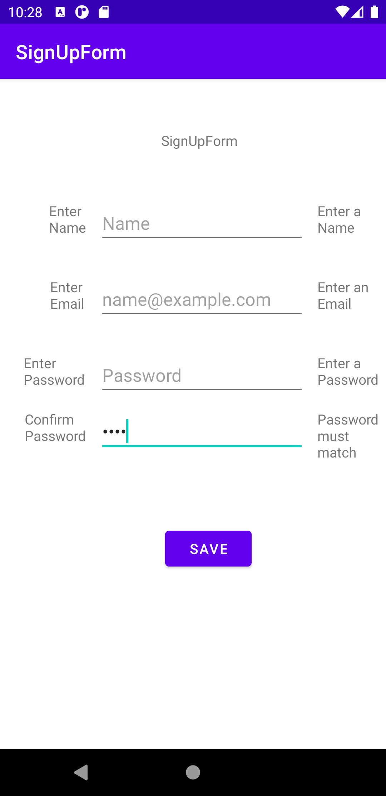

## SignUpForm App - CIS 3515 Assignment 2 - Grant Gwiazdowski

This app creates a layout with views for entering user info for signing up (i.e. email, password, name).
Errors appear on the right of the editText views when the save button is clicked, they disapear when appropriate 
the information is filed and the button is clicked. When all appropriate info is filled and passwords match. A
Toast appears welcoming the User by the name entered.

